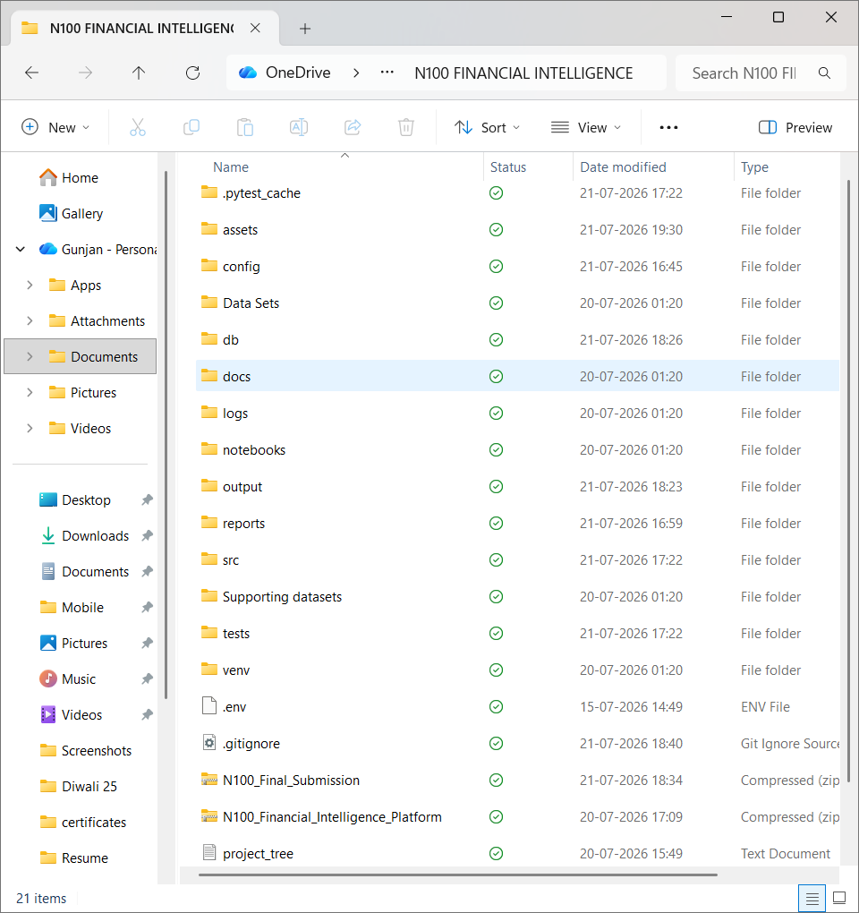
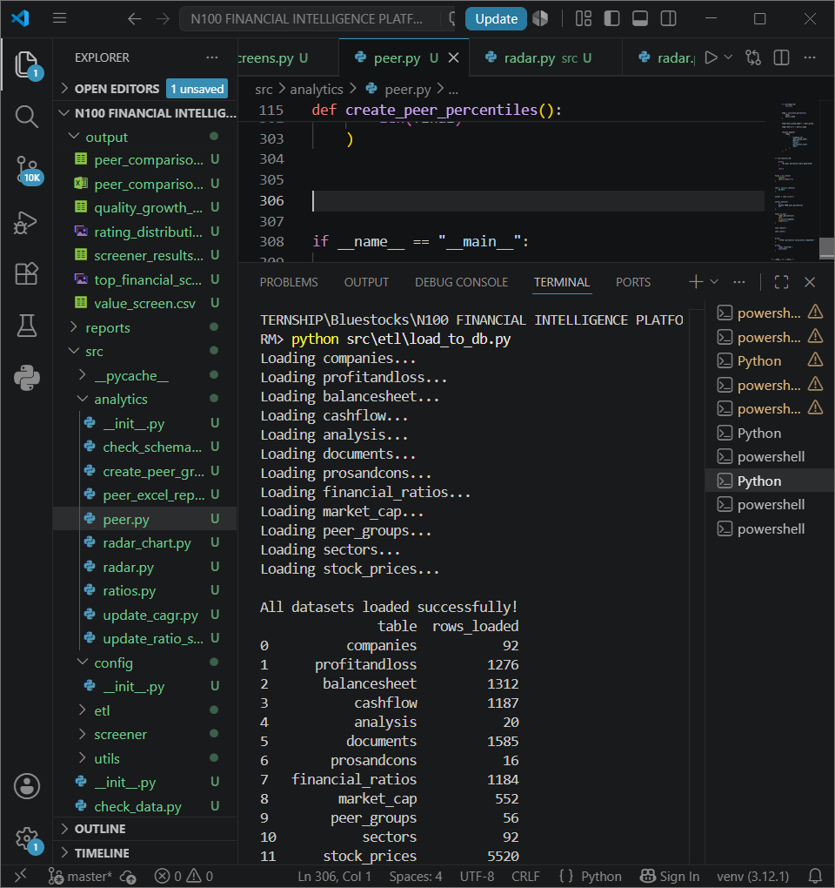
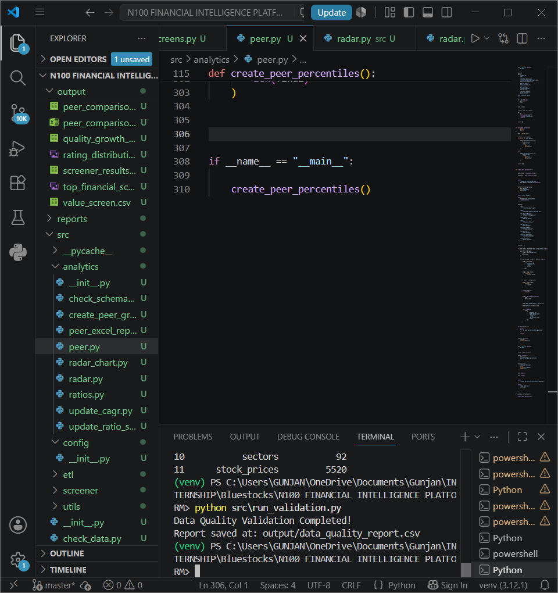
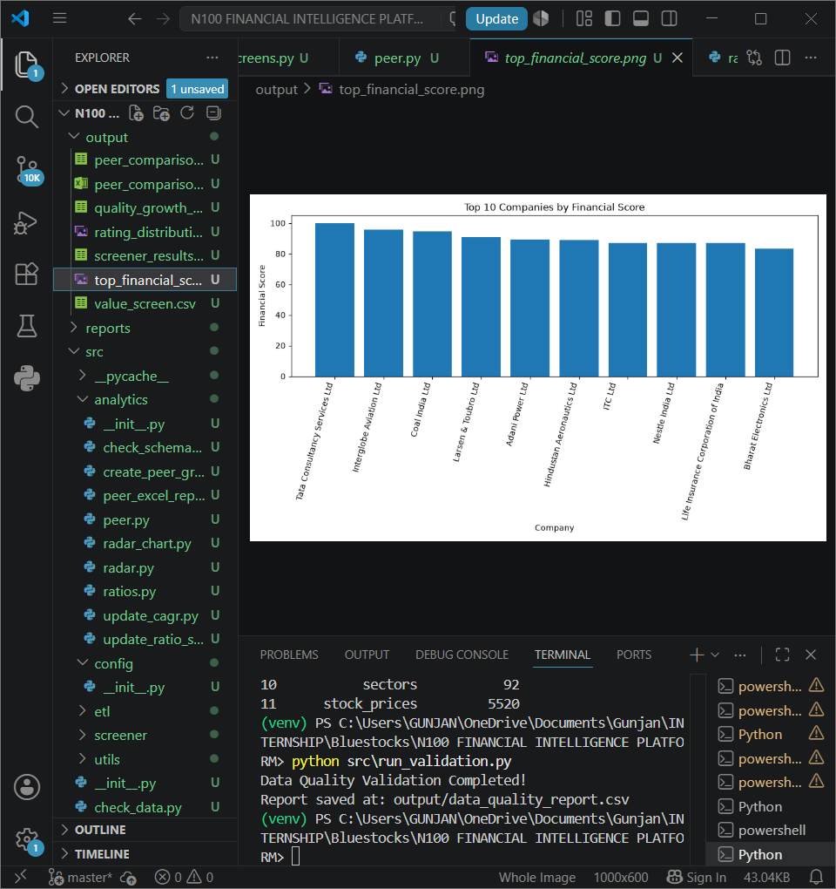
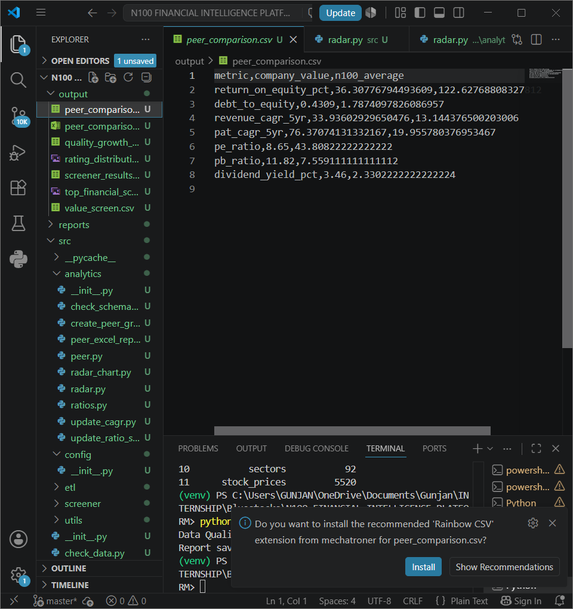

# 📈 N100 Financial Intelligence Platform

An end-to-end Financial Analytics Platform built using Python and SQLite to analyze Nifty 100 companies through automated ETL pipelines, financial ratio analysis, company scoring, stock screening, peer comparison, and visualization.

---

## 🚀 Project Overview

The **N100 Financial Intelligence Platform** automates the complete financial analytics workflow for Nifty 100 companies. It transforms raw financial datasets into actionable investment insights using Python-based data engineering and analytics.

### The platform includes:

- 📥 ETL Pipeline
- 🗄 SQLite Database
- ✅ Data Validation Framework
- 📊 Financial Ratio Engine
- ⭐ Financial Scoring Model
- 🔍 Stock Screening Engine
- 🤝 Peer Comparison Engine
- 📈 Radar Chart Visualization
- 📄 Automated Reporting

---

# 🛠 Tech Stack

### Programming Languages

- Python
- SQL

### Libraries

- Pandas
- NumPy
- Matplotlib
- OpenPyXL
- PyYAML

### Database

- SQLite

---

# 📂 Project Structure



---

# ⚙ ETL Pipeline

The ETL pipeline automatically:

- Loads Excel datasets
- Cleans and normalizes data
- Performs validation
- Loads data into SQLite
- Generates audit reports



---

# ✅ Data Validation Framework

Validation includes:

- Missing value detection
- Schema validation
- Data consistency checks
- Quality report generation



---

# 📊 Financial Ratio Engine

The platform computes important financial metrics including:

- ROE
- ROCE
- ROA
- Net Profit Margin
- Revenue CAGR
- PAT CAGR
- Operating Margin

---

# ⭐ Financial Scoring Model

Ranks companies based on multiple financial metrics and generates scorecards.



---

# 🔍 Stock Screening Engine

Supports custom investment screening using filters such as:

- ROE
- Debt-to-Equity
- Revenue Growth
- Profitability
- Valuation
- Market Capitalization

Generated outputs include:

- Value Screen
- Dividend Screen
- Quality Growth Screen

---

# 🤝 Peer Comparison

Compares companies against industry peers using important financial metrics.

Generated Outputs:

- CSV Reports
- Excel Reports



---

# 📈 Visualizations

The project automatically generates:

- Financial Score Distribution
- Top Financial Score Charts
- Company Radar Charts
- Peer Comparison Reports

---

# 📁 Output Files

Generated automatically:

- Financial Scorecards
- Screening Reports
- Peer Comparison Reports
- Radar Charts
- Excel Reports
- Data Quality Reports
- CSV Reports

---

# 📂 Folder Structure

```
N100 Financial Intelligence Platform
│
├── Data Sets
├── Supporting datasets
├── db
├── output
├── reports
├── src
│   ├── analytics
│   ├── etl
│   ├── screener
│   └── utils
├── tests
├── assets
│   └── screenshots
├── README.md
└── requirements.txt
```

---

# ▶ How to Run

Clone the repository

```bash
git clone https://github.com/lutadegunjan/N100-Financial-Intelligence-Platform.git
```

Install dependencies

```bash
pip install -r requirements.txt
```

Run Data Validation

```bash
python src/run_validation.py
```

Generate Financial Scores

```bash
python src/financial_score.py
```

Run Stock Screener

```bash
python src/screener/screens.py
```

Generate Peer Comparison

```bash
python src/analytics/peer.py
```

Generate Radar Charts

```bash
python src/analytics/radar_chart.py
```

---

# 💼 Skills Demonstrated

- Python Programming
- SQL
- ETL Development
- Data Engineering
- Financial Analytics
- Business Intelligence
- Data Validation
- Reporting Automation
- Data Visualization
- SQLite Database Design

---

# 👨‍💻 Author

**Gunjan Lutade**

📧 Email: lutadegunjan@gmail.com

🔗 LinkedIn: https://www.linkedin.com/in/gunjan-lutade-67029b22a/

💻 GitHub: https://github.com/lutadegunjan

---

⭐ If you found this project interesting, consider giving it a star!